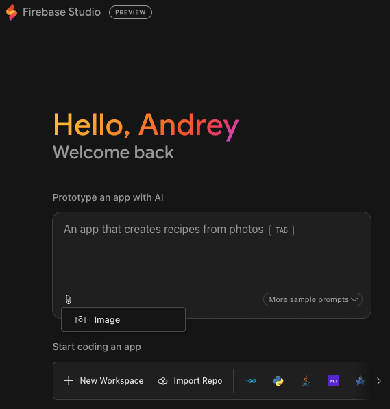

# Design, Prototype, Build, and Deploy on Google Cloud: A Comprehensive Guide

---
**\* The opinions expressed in this article are solely those of the author([Andrey Shakirov](https://www.linkedin.com/in/andrey-shakirov-000b4a5/)) and do not reflect the views of their employer.**

---

This document explores a suite of powerful Google tools and Google Cloud services designed to streamline the entire application development lifecycle, from initial design and creative asset generation to rapid prototyping, building, and deploying sophisticated applications, with a special focus on leveraging cutting-edge AI capabilities.

Discover how tools like **Google Stitch** and **Google Flow** are revolutionizing UI design and AI-powered filmmaking. Dive into the developer's toolkit for rapid app prototyping with **Google AI Studio**, **Firebase Studio**, and the autonomous AI coding agent **Jules**. We'll also cover low-code/no-code platforms, serverless compute options, and essential data services on Google Cloud that empower you to bring your ideas to life faster than ever.

* [Google Stitch: For UI Design and Frontend Code Generation](#google-stitch-for-ui-design-and-frontend-code-generation)
* [Google Flow: For AI-Powered Filmmaking and Video Asset Creation](#google-flow-for-ai-powered-filmmaking-and-video-asset-creation)
* [Rapid App Prototyping on Google Cloud: A Developer's Toolkit](#rapid-app-prototyping-on-google-cloud-a-developers-toolkit)
  * [Google AI Studio: Your Gateway to Generative AI Applications](#google-ai-studio-your-gateway-to-generative-ai-applications)
  * [Firebase Studio: Full-Stack AI App Development in the Cloud](#firebase-studio-full-stack-ai-app-development-in-the-cloud)
  * [Jules: Your Autonomous AI Coding Agent](#jules-your-autonomous-ai-coding-agent)
  * [Low-Code/No-Code Platforms](#low-codeno-code-platforms)
  * [Serverless Compute Options (for developers)](#serverless-compute-options-for-developers)
    * [APIs and microservices](#apis-and-microservices)
    * [Streaming data processing](#streaming-data-processing)
    * [Batch data processing](#batch-data-processing)
    * [Serverless mobile backends](#serverless-mobile-backends)
    * [Integration with third-party services and APIs](#integration-with-third-party-services-and-apis)
    * [Real-time file processing](#real-time-file-processing)
    * [Sentiment analysis](#sentiment-analysis)
  * [Data and Backend Services for Prototyping](#data-and-backend-services-for-prototyping)
  * [Other Important Considerations for Prototyping](#other-important-considerations-for-prototyping)
* [Conclusion](#conclusion)
* [Building GenAI agents on Google Cloud](#building-genai-agents-on-google-cloud)

### Design and creative assets

When considering Google's tools for **design and creative assets**, "Google Stitch" and "Google Flow" emerge as cutting-edge AI-powered solutions, each targeting different aspects of the creative pipeline:

### Google Stitch: For UI Design and Frontend Code Generation

**Google Stitch ([stitch.withgoogle.com](https://stitch.withgoogle.com/))** is an experimental tool from Google Labs that aims to bridge the gap between design ideas and functional user interfaces (UIs) by leveraging advanced AI.

* **Core Function:** It transforms various inputs into complex UI designs and accompanying frontend code.
* **Inputs:**
    * **Natural Language Descriptions:** Describe your desired UI in plain English (e.g., "a dark-themed mobile app homepage with a navigation bar and a profile card").
    * **Images/Wireframes:** Upload sketches, rough wireframes, or even screenshots of existing UIs as a visual reference.
* **Outputs:**
    * **High-Quality UI Designs:** Generates visual layouts, components, and styles based on your input.
    * **Functional Frontend Code:** Provides clean HTML, CSS, and potentially framework-specific code that you can directly use in your development environment.
* **Key Strengths for Design & Creative Assets:**
    * **Rapid UI Prototyping:** Accelerates the creation of visual mockups and interactive prototypes in minutes, enabling quick iteration on design concepts.
    * **Seamless Design-to-Dev Handoff:** Generates code directly from designs, significantly reducing the manual effort and potential for errors in translating designs into functional UIs.
    * **Iterative Design Exploration:** Allows you to generate multiple design variants from a single prompt, making it easy to experiment with different layouts, themes, and styles.
    * **Figma Integration:** Offers a "Paste to Figma" feature for further refinement, collaboration within design teams, and integration into existing design systems.
    * **Accessibility:** Empowers users with limited design or coding experience to create professional-grade UI assets.

### Google Flow: For AI-Powered Filmmaking and Video Asset Creation

**Google Flow ([labs.google/flow/about](https://labs.google/flow/about))** is Google's new AI filmmaking interface, purpose-built to harness the power of its advanced generative AI models like **Veo 3** (for video), **Imagen** (for images), and **Gemini** (for natural language understanding and consistency).

* **Core Function:** It enables users to create, extend, and manage cinematic video clips and scenes using AI.
* **Inputs:**
    * **Natural Language Prompts:** Describe your desired video scene, characters, actions, and even camera movements in everyday language.
    * **Reference Images/Assets:** Upload your own images or generate new ones within Flow (using Imagen) to guide the visual style or incorporate specific subjects/environments.
* **Outputs:**
    * **Cinematic Video Clips:** Generates high-quality video footage (up to 1080p) with impressive realism and physics adherence.
    * **Consistent Scenes:** Features like "Scenebuilder" allow extending clips or transitioning between shots while maintaining visual consistency (e.g., character appearance, lighting, pacing).
    * **Native Audio:** Veo 3's groundbreaking ability to generate synchronized dialogue, environmental sounds, and music directly within the video, creating a complete audiovisual asset.
* **Key Strengths for Design & Creative Assets:**
    * **Rapid Video Content Creation:** Quickly generate visual stories, concepts, or pre-visualizations that would otherwise require extensive traditional filmmaking resources.
    * **Creative Exploration:** Experiment with diverse narratives, visual styles, and even fantastical scenarios with unprecedented speed and flexibility.
    * **Iterative Storytelling:** Easily modify and extend scenes, allowing for dynamic iteration on a visual narrative.
    * **Democratization of Filmmaking:** Lowers the barrier to entry for creating high-quality video assets, empowering a wider range of creators.
    * **Comprehensive Workflow:** Integrates prompting, asset management, camera controls, and scene editing within a single interface.

In summary, **Google Stitch** focuses on **static and interactive UI elements and their corresponding code**, streamlining the app design and frontend development process. **Google Flow**, powered by **Veo 3**, revolutionizes **dynamic video content creation**, enabling rapid generation and iteration of cinematic scenes with synchronized audio. Both represent significant advancements in leveraging AI to empower designers and creatives in their respective domains.

## Rapid App Prototyping on Google Cloud: A Developer's Toolkit

In today's fast-paced development landscape, getting ideas from concept to a tangible prototype quickly is paramount. Google Cloud offers a robust ecosystem of tools designed to accelerate this process, particularly for applications leveraging the power of Artificial Intelligence. Let's explore some key options, including AI Studio, Firebase Studio, and the exciting new Jules.

### Google AI Studio: Your Gateway to Generative AI Applications

For developers keen on building AI-powered applications, **Google AI Studio ([aistudio.google.io](https://aistudio.google.com/apps))** is an indispensable starting point. This web-based environment provides a streamlined way to experiment with Google's cutting-edge generative AI models, like Gemini.

**Key features for prototyping:**

* **Prompt Engineering and Model Customization:** Easily test sample prompts, design your own, and fine-tune foundation models and large language models (LLMs) to meet your application's specific needs. This is crucial for iterating on the core AI functionality of your app.
* **Code Generation and Deployment:** AI Studio now offers native code generation capabilities, allowing you to generate app code from simple text, image, or video prompts. Crucially, you can deploy these generated apps directly to Cloud Run with a single click, providing a stable HTTPS endpoint that scales automatically. This significantly shortens the loop from idea to a shareable, functional web application.
* **Multimodal Capabilities:** With access to models like Gemini, Imagen, and Veo, AI Studio empowers you to build applications that understand and generate various modalities, including text, code, images, audio, and video.
* **URL Context Tool:** An experimental tool that enables models to retrieve and reference content from provided URLs, aiding in tasks like fact-checking, summarization, and deeper research, which can be invaluable for many AI-driven applications.

### Firebase Studio: Full-Stack AI App Development in the Cloud

**Firebase Studio ([studio.firebase.google.com](https://firebase.studio/))** takes app prototyping to the next level by offering a comprehensive, cloud-based development environment. It combines a full IDE (based on VS Code), AI assistance from Gemini, and deep integration with Firebase services.

**How Firebase Studio accelerates prototyping:**

* **App Prototyping Agent:** This powerful feature allows you to describe your app idea in natural language, or even with images and drawing tools. The agent then generates an app blueprint, code, and a live web preview. This "no-code" approach for initial drafts is a game-changer for rapid iteration.
* **Integrated Development Environment (IDE):** Beyond prototyping with AI, Firebase Studio provides a familiar coding workspace where you can refine the generated code, add features, debug, and connect to Firebase backend services (Firestore, Auth, Hosting, Functions, etc.). Gemini in Firebase assists with code completion, debugging, and explaining code.
* **Instant Previews and Deployment:** Firebase Studio offers instant web previews, allowing you to see changes in real-time. Once satisfied, you can publish your app to Firebase App Hosting with a single click, leveraging Google's CDN for global distribution. This makes sharing prototypes for feedback incredibly easy.
* **Collaboration:** You can share your workspaces with others for real-time collaboration, facilitating team-based prototyping and development.

### Jules: Your Autonomous AI Coding Agent

**Jules ([jules.google.com](https://jules.google.com))** represents a significant leap in AI-assisted development. This autonomous agent integrates directly with your GitHub repository, acting as a highly capable coding assistant that can understand intent and execute complex tasks across your codebase.

**How Jules empowers prototyping (and beyond):**

* **Autonomous Code Generation and Refactoring:** Unlike simple code completion tools, Jules can proactively make multi-step changes. You can prompt it to write tests, build new features, fix bugs, or even bump dependency versions. It analyzes your entire codebase within a secure Google Cloud VM to ensure context-aware changes.
* **GitHub Integration and Pull Requests:** Jules works directly within your existing GitHub workflow. It clones your repository, performs the requested tasks, and then creates a pull request with a detailed plan, reasoning, and a diff of the changes for your review. This seamlessly integrates AI-generated code into your existing development process.
* **Asynchronous Operation:** Jules operates in the background, allowing you to focus on other tasks while it works. You receive notifications when tasks are complete or require your input.
* **Powered by Gemini 2.5 Pro:** Leveraging Google's most advanced AI model, Jules can handle complex, multi-file changes and concurrent tasks with speed and precision, making it suitable for practical, real-world software engineering.

While AI Studio, Firebase Studio, and Jules are cutting-edge and highly relevant for AI-powered app prototyping, Google Cloud's vast array of services offers many other powerful options, catering to different needs and levels of technical expertise. Here are some significant additions:

### Low-Code/No-Code Platforms

For even faster prototyping, especially for business users or those with limited coding experience, Google Cloud provides robust low-code and no-code solutions:

* **Google AppSheet:** This is Google's flagship no-code platform. AppSheet allows you to create mobile and web applications directly from your data sources (like Google Sheets, Excel, Cloud SQL, Salesforce, etc.) without writing a single line of code.
    * **Prototyping Use Cases:** Quickly build internal tools (e.g., inventory management, field data collection, simple CRMs), customer portals, or process automation apps.
    * **Key Strengths:** Drag-and-drop interface, strong integration with Google Workspace, built-in AI capabilities (like OCR, predictive modeling), and automatic mobile/web deployment. It's excellent for citizen developers to validate ideas quickly.

### Serverless Compute Options (for developers)

For developers who need more control than no-code platforms but still want to avoid managing servers, Google Cloud's serverless compute offerings are ideal for prototyping:

* **Cloud Run:** This is a fully managed compute platform for deploying containerized applications. It allows you to run stateless containers that are automatically scaled up or down based on demand, even to zero instances when not in use.
    * **Prototyping Use Cases:** Ideal for microservices, web services, APIs, and event-driven functions. If your prototype involves a custom backend logic, machine learning inference endpoints, or needs to handle spiky traffic, Cloud Run is a fantastic choice. You can deploy any language or framework as long as it can be containerized.
    * **Key Strengths:** "Scale to zero" for cost efficiency, support for any language/runtime, high flexibility, and excellent integration with other Google Cloud services like Cloud SQL, Cloud Storage, and Pub/Sub.

Use cases: [Cloud Run Use Cases](https://cloud.google.com/run#websites-and-web-applications)

#### APIs and microservices

#### Streaming data processing

#### Batch data processing

* **Cloud Functions:** This is Google Cloud's Functions-as-a-Service (FaaS) offering. You write small, single-purpose functions that respond to events (e.g., HTTP requests, changes in a database, messages on a queue).
    * **Prototyping Use Cases:** Building quick backend APIs, webhooks, data processing triggers, or integrating with third-party services. Think of small, discrete pieces of logic that don't require a full web server.
    * **Key Strengths:** Pay-per-invocation pricing (highly cost-effective for low-traffic prototypes), automatic scaling, and event-driven architecture makes it very responsive.

Use cases: https://cloud.google.com/functions#use-cases

#### Serverless mobile backends

#### Integration with third-party services and APIs

#### Real-time file processing

#### Sentiment analysis

### Data and Backend Services for Prototyping

Beyond the compute layer, effective prototyping often requires data storage and backend functionality:

* **Cloud Firestore:** A NoSQL document database built for automatic scaling, high performance, and ease of application development. It offers real-time synchronization, making it perfect for dynamic web and mobile app prototypes.
    * **Prototyping Use Cases:** Storing user data, application state, and real-time data for your prototypes. Its offline capabilities and real-time listeners simplify front-end development.

* **Cloud SQL:** A fully managed relational database service for MySQL, PostgreSQL, and SQL Server. If your prototype requires a traditional relational database schema, Cloud SQL provides an easy way to get one up and running without database administration overhead.
    * **Prototyping Use Cases:** Prototypes requiring structured data, complex queries, or integrations with existing relational data models.

* **Cloud Storage:** Google's highly scalable and durable object storage.
    * **Prototyping Use Cases:** Storing user-uploaded content (images, videos), static assets for your web apps, or backend data files.

### Other Important Considerations for Prototyping

* **Vertex AI:** While AI Studio provides a streamlined experience for generative AI, Vertex AI is the broader, unified platform for machine learning development. For more complex AI/ML prototypes (e.g., custom model training, MLOps workflows, larger-scale data processing for AI), Vertex AI offers a comprehensive suite of tools.
* **Google Cloud Marketplace:** Explore pre-built solutions and third-party tools that can accelerate your prototyping by integrating existing services or components.
* **Google Cloud Free Tier:** Many Google Cloud services offer a free tier, allowing you to experiment and prototype at no cost, or at a very low cost, which is invaluable for early-stage development.

By combining these diverse Google Cloud options, developers have an extensive toolkit to move from idea to functional prototype with incredible speed and flexibility, choosing the right level of abstraction and control for each project.

### Conclusion
Google Cloud provides a comprehensive suite of tools that significantly accelerate the app prototyping process, particularly for AI-driven applications. From AI Studio's generative model experimentation and rapid deployment to Firebase Studio's full-stack IDE with AI assistance and Jules's autonomous coding agent, developers can leverage various levels of abstraction and automation. Low-code/no-code platforms like AppSheet empower non-developers, while serverless compute options like Cloud Run and Cloud Functions offer scalable, flexible backends. Combined with robust data and storage services like Firestore, Cloud SQL, and Cloud Storage, and broader platforms like Vertex AI, developers have a powerful ecosystem to rapidly iterate, validate ideas, and build functional prototypes with speed and efficiency, suitable for a wide range of needs and technical expertise.

---
### Building GenAI agents on Google Cloud

If you are still here and want to learn more about building GenAI agents on Google Cloud, check out the following resources:
https://github.com/gitrey/genai-agent-on-google-cloud

**TLDR:**

* [**Agentspace**](https://cloud.google.com/products/agentspace) \- Enterprise search over your enterprise data sources, Gemini for summarization and multi-modal content generation and GenAI agents for actions to help you work faster.  
* [**AI Applications | Agent Builder**](https://cloud.google.com/products/agent-builder) \- no-code, low-code option to build, deploy and integrate agents into the interfaces that your users use already(Existing web applications, Slack, Google Chat, MS Team, Agentspace, etc)  
* [**Agent Development Kit**](https://google.github.io/adk-docs/)**(ADK)** developer focused option. An open-source, code-first Python toolkit for building, evaluating, and deploying sophisticated multi-agents systems with flexibility and control.